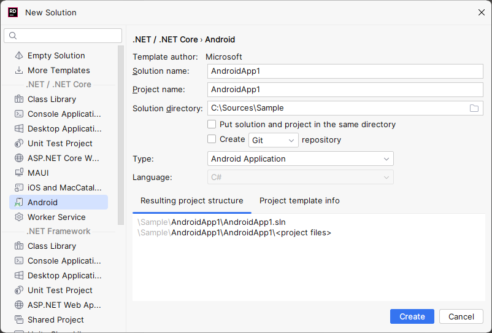

# AndroidApp1

see: https://youtrack.jetbrains.com/issue/RIDER-99102

1. Install Rider 2023.3.2
2. Create `New Solution`
3. Select `Android`
4. Open `Resources/layout/activity_main.xml`





```
JetBrains Rider 2023.3.2
Build #RD-233.13135.100, built on December 20, 2023
Licensed to 
Subscription is active until June 6, 2024.
Runtime version: 17.0.9+7-b1087.9 amd64
VM: OpenJDK 64-Bit Server VM by JetBrains s.r.o.
Windows 11.0
.NET Core v7.0.10 x64 (Server GC)
GC: G1 Young Generation, G1 Old Generation
Memory: 3830M
Cores: 12
Registry:
  editor.config.csharp.support=true
  ide.experimental.ui=true
Non-Bundled Plugins:
  com.jetbrains.rider.android (233.13135.100)
```